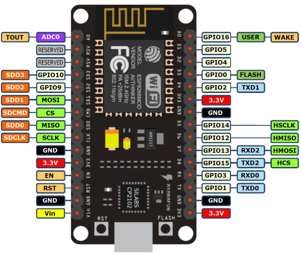

# Getting started with a Node MCU

A Node MCU is a small prototyping board based around the ESP8266 microcontroller. 
It has built-in WiFi and several digital general purpose input/output (GPIO) pins, as well as one analog input.
In addition it supports serial communication via UART, SPI, and I2C. 

### Examples 

You can use this to talk to other devices, or the Internet/the cloud. You can make "Useless-boxes", robots, plant irrigation systems, beer counter, netflix alert, refrigator monitoring systems, or whatever you put your mind to. 

## Mac 
If you are on a mac, you might need to install a USB driver from https://www.silabs.com/products/mcu/Pages/USBtoUARTBridgeVCPDrivers.aspx ([direct link](https://www.silabs.com/Support%20Documents/Software/Mac_OSX_VCP_Driver.zip))

## Setup
* Install and launch the Arduino software from https://www.arduino.cc/en/Main/Software
* Open Preferences and enter http://arduino.esp8266.com/stable/package_esp8266com_index.json into the "Additional Board Manager URLs" field.
* Press OK
* Open Boards Manager from Tools > Board menu. Find and install the esp8266 platform
* Press Close when done
* Physical assemble the circuit
  * Long leg on LED the connects to D4
  * Short leg on the LED connects to a free slot on the end
  * Resistor connects the short LED leg to GND
  * D4 > LED (long leg) > UNUSED/FREE hole in the breadboard > Resistor > GND
  * **Make sure that one leg of the resistor and the LED sits on the same column and is not connected to pins on the Node MCU**
  * **Make sure everything is correct!**
  * *If the LED does not glow when you run the **complete** example you can test it by using the `3V3` pin instead of D4. Try turning it around*
* Connect your ESP8266 using a suitable USB cable
* Select Tools > Board > NodeMCU 1.0 (…)
* Select Tools > Port > `<Your ESP8266 Port>` (`/dev/tty.SLAB_USBtoUART` on a Mac)
* Type in or copy the program in the [ardu.ino](ardu.ino) file.
* Press Upload
* Connect a device to the WLAN with the SSID `ESP826`
* Open a browser and enter [http://192.168.4.1/](http://192.168.4.1/). The LED state should change every time you press reload
* Have fun!

